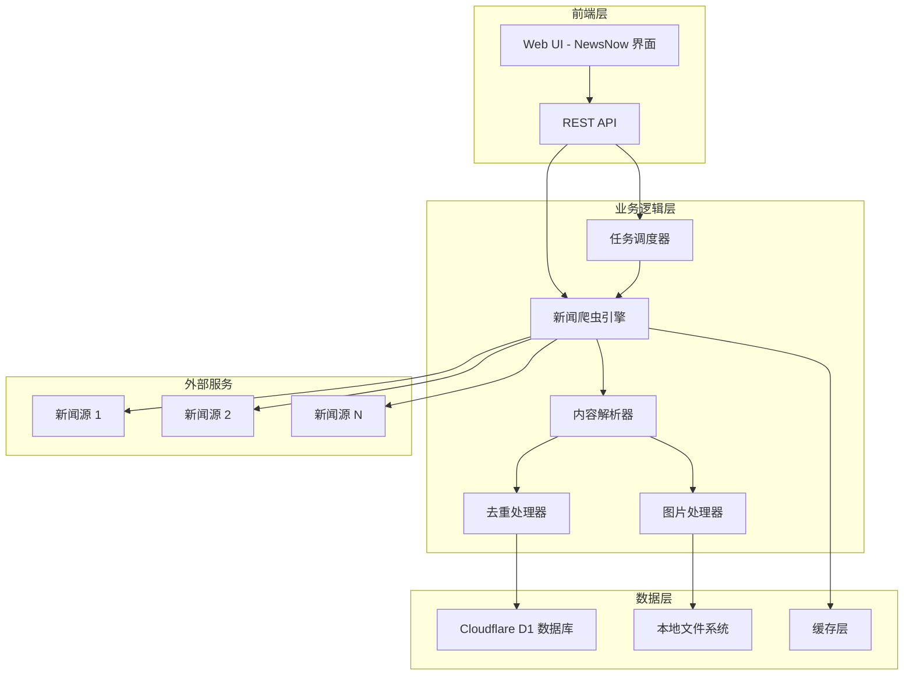

# 设计文档

## 概述

news_catch 系统基于 NewsNow (ourongxing/newsnow) 开源项目构建，采用 Node.js + Cloudflare D1 架构实现新闻抓取、存储和展示功能。系统设计遵循 MVP 原则，专注于核心抓取和存储功能，同时为后续迭代预留扩展接口。

### 核心设计原则
- **基于 NewsNow 架构**：继承其 MCP Server 架构和缓存机制
- **插件化扩展**：支持新闻源和解析器的动态扩展
- **数据标准化**：为后续 AI 分析和平台迁移做准备
- **实时性优化**：支持分钟级新闻更新

## 架构

### 系统架构图



### 技术栈
- **运行时**：Node.js
- **数据库**：Cloudflare D1 (SQLite)
- **缓存**：内存缓存 + 文件缓存
- **前端**：基于 NewsNow 的 Web 界面
- **部署**：Cloudflare Workers (可选本地部署)

## 组件和接口

### 1. 新闻爬虫引擎 (Crawler Engine)

**职责**：
- 管理多个新闻源的抓取任务
- 处理网络请求和错误重试
- 实现频率控制和反爬虫机制

**接口**：
```typescript
interface CrawlerEngine {
  addSource(source: NewsSource): void;
  removeSource(sourceId: string): void;
  startCrawling(): Promise<void>;
  stopCrawling(): void;
  getCrawlStatus(): CrawlStatus;
}

interface NewsSource {
  id: string;
  name: string;
  url: string;
  type: 'rss' | 'html' | 'api';
  config: SourceConfig;
  enabled: boolean;
}
```

### 2. 内容解析器 (Content Parser)

**职责**：
- 解析不同格式的新闻内容
- 提取结构化数据
- 支持插件化解析规则

**接口**：
```typescript
interface ContentParser {
  parse(content: string, source: NewsSource): Promise<ParsedArticle>;
  registerParser(type: string, parser: ParserPlugin): void;
}

interface ParsedArticle {
  title: string;
  content: string;
  summary?: string;
  publishTime: Date;
  author?: string;
  source: string;
  url: string;
  images: ImageInfo[];
  tags: string[];
}
```

### 3. 任务调度器 (Task Scheduler)

**职责**：
- 管理定时抓取任务
- 处理任务队列和优先级
- 监控任务执行状态

**接口**：
```typescript
interface TaskScheduler {
  scheduleTask(task: CrawlTask): void;
  cancelTask(taskId: string): void;
  getTaskStatus(taskId: string): TaskStatus;
  setSchedule(sourceId: string, schedule: CronSchedule): void;
}
```

### 4. 数据存储层 (Data Storage)

**职责**：
- 管理结构化数据存储
- 处理数据去重和索引
- 提供查询和搜索接口

**接口**：
```typescript
interface DataStorage {
  saveArticle(article: ParsedArticle): Promise<string>;
  getArticle(id: string): Promise<ParsedArticle | null>;
  searchArticles(query: SearchQuery): Promise<SearchResult>;
  deleteArticle(id: string): Promise<void>;
}
```

### 5. 图片处理器 (Image Handler)

**职责**：
- 下载和存储新闻图片
- 图片格式转换和压缩
- 管理图片文件路径

**接口**：
```typescript
interface ImageHandler {
  downloadImage(url: string, articleId: string): Promise<ImageInfo>;
  getImagePath(imageId: string): string;
  cleanupImages(articleId: string): Promise<void>;
}

interface ImageInfo {
  id: string;
  originalUrl: string;
  localPath: string;
  format: string;
  size: number;
}
```

## 数据模型

### 1. 文章数据模型

```sql
CREATE TABLE articles (
  id TEXT PRIMARY KEY,
  title TEXT NOT NULL,
  content TEXT NOT NULL,
  summary TEXT,
  publish_time DATETIME NOT NULL,
  crawl_time DATETIME DEFAULT CURRENT_TIMESTAMP,
  author TEXT,
  source_id TEXT NOT NULL,
  source_url TEXT NOT NULL,
  hash TEXT UNIQUE NOT NULL, -- 用于去重
  status TEXT DEFAULT 'active', -- active, archived, deleted
  tags TEXT, -- JSON array
  metadata TEXT -- JSON object for extensibility
);

CREATE INDEX idx_articles_publish_time ON articles(publish_time);
CREATE INDEX idx_articles_source_id ON articles(source_id);
CREATE INDEX idx_articles_hash ON articles(hash);
```

### 2. 新闻源配置模型

```sql
CREATE TABLE news_sources (
  id TEXT PRIMARY KEY,
  name TEXT NOT NULL,
  url TEXT NOT NULL,
  type TEXT NOT NULL, -- rss, html, api
  config TEXT NOT NULL, -- JSON configuration
  enabled BOOLEAN DEFAULT true,
  last_crawl DATETIME,
  crawl_interval INTEGER DEFAULT 300, -- seconds
  error_count INTEGER DEFAULT 0,
  created_at DATETIME DEFAULT CURRENT_TIMESTAMP,
  updated_at DATETIME DEFAULT CURRENT_TIMESTAMP
);
```

### 3. 图片数据模型

```sql
CREATE TABLE images (
  id TEXT PRIMARY KEY,
  article_id TEXT NOT NULL,
  original_url TEXT NOT NULL,
  local_path TEXT NOT NULL,
  format TEXT NOT NULL,
  size INTEGER,
  width INTEGER,
  height INTEGER,
  created_at DATETIME DEFAULT CURRENT_TIMESTAMP,
  FOREIGN KEY (article_id) REFERENCES articles(id) ON DELETE CASCADE
);
```

### 4. 抓取日志模型

```sql
CREATE TABLE crawl_logs (
  id TEXT PRIMARY KEY,
  source_id TEXT NOT NULL,
  start_time DATETIME NOT NULL,
  end_time DATETIME,
  status TEXT NOT NULL, -- running, success, failed
  articles_found INTEGER DEFAULT 0,
  articles_saved INTEGER DEFAULT 0,
  error_message TEXT,
  FOREIGN KEY (source_id) REFERENCES news_sources(id)
);
```

## 错误处理

### 1. 网络错误处理
- **重试机制**：指数退避算法，最多重试 3 次
- **超时处理**：请求超时 30 秒，连接超时 10 秒
- **频率限制**：动态调整抓取间隔，避免被封禁
- **错误记录**：详细记录错误信息和上下文

### 2. 数据处理错误
- **解析失败**：保存原始内容，标记为待处理
- **重复数据**：基于内容哈希进行去重
- **存储失败**：事务回滚，保证数据一致性
- **图片下载失败**：记录错误但不影响文本处理

### 3. 系统错误处理
- **内存溢出**：限制并发数量，实现内存监控
- **磁盘空间不足**：自动清理旧文件，发送告警
- **数据库连接失败**：连接池管理，自动重连
- **服务崩溃**：进程守护，自动重启

## 测试策略

### 1. 单元测试
- **覆盖率目标**：80% 以上
- **测试框架**：Jest
- **测试重点**：
  - 内容解析器的各种格式处理
  - 数据存储的 CRUD 操作
  - 错误处理逻辑
  - 去重算法

### 2. 集成测试
- **API 测试**：使用 Supertest 测试 REST API
- **数据库测试**：使用测试数据库进行集成测试
- **爬虫测试**：使用 Mock 服务器模拟新闻源
- **端到端测试**：完整的抓取流程测试

### 3. 性能测试
- **并发测试**：模拟多个新闻源同时抓取
- **内存测试**：长时间运行的内存泄漏检测
- **数据库性能**：大量数据的查询性能测试
- **网络测试**：不同网络条件下的抓取性能

### 4. 监控和告警
- **系统监控**：CPU、内存、磁盘使用率
- **业务监控**：抓取成功率、数据质量
- **错误告警**：关键错误的实时通知
- **性能告警**：响应时间和吞吐量监控

## 部署和运维

### 1. 部署架构
- **开发环境**：本地 Node.js + SQLite
- **测试环境**：Docker 容器化部署
- **生产环境**：Cloudflare Workers + D1 数据库

### 2. 配置管理
- **环境变量**：敏感信息通过环境变量管理
- **配置文件**：使用 JSON/YAML 配置文件
- **动态配置**：支持运行时配置更新

### 3. 日志管理
- **日志级别**：DEBUG, INFO, WARN, ERROR
- **日志格式**：结构化 JSON 日志
- **日志轮转**：按大小和时间轮转日志文件
- **日志聚合**：集中式日志收集和分析

### 4. 备份和恢复
- **数据备份**：定期备份数据库和图片文件
- **配置备份**：版本控制管理配置文件
- **灾难恢复**：快速恢复流程和文档
- **数据迁移**：支持数据导入导出功能